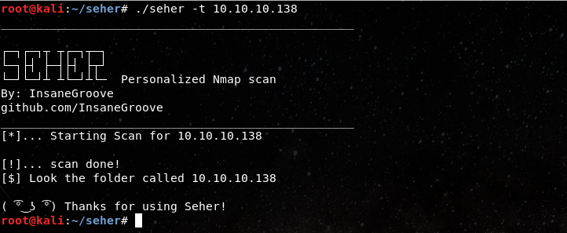
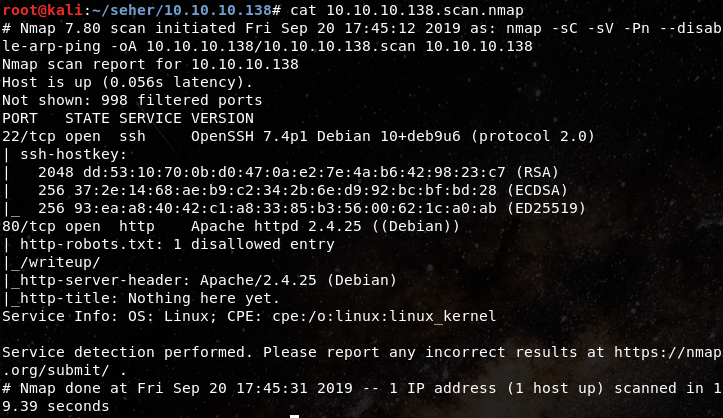

# Seher
This programs has been programmed with the purpose of saving time at the time to run an nmap scan. 

# Purpose
To be clear this is a on developing script to improve its characteristics. The final goal is to scan for vulnerabilites finded in services with some nmap scripts. Within services, seher will scan smb, ssh, ftp, smtp, mysql and such. For now, It's been realise for proofs and to get more ideas to improve the script. The usage must be simple with the goal of saving time. 

# Requirements
Seher can run in any Linux distro based on Debian. Also they **most have installed Nmap**. In this case I'm using Kali Linux, and personally, I recommend you to run this script in Kali. 

# Usage
**Seher will create** a  directory with the target's name, run the scan and **make a file with the scan result**.
For this, you can follow the next steps:
1. Clone the repository in your machine. 
`git clone https://github.com/InsaneGroove/seher.git `
2. Open the direcory and run as **root** the file called **setup.py**
`python setup.py`
3. After seher is located with privileges in your binary, your free to run the scan. 
`seher -t 10.10.10.138`

# Results
Here we are using a machine called **Writeup** from [**Hack The Box**](https://www.hackthebox.eu). The results will look like this. 

